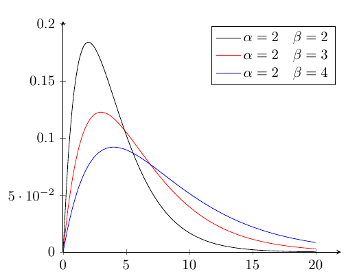
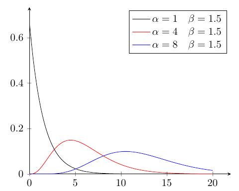

## ガンマ分布
指数分布は所定時間内に平均(\lambda)回発生する事象が,指定された時間内に1回事象が発生する確率であったが,
所定時間内に平均(\lambda)回発生する事象が,指定された時間内にn回発生する確率を考える.

上記\\(\lambda\\)を単位時間内に事象が発生する平均回数(単位時間内の発生割合)とすると,
任意時間\\(t\\)にて,\\(x\\)回事象が発生する確率は,ポアソン分布にて,
\\[
	P_{po}(X=x|T=t:\lambda) = \frac{(\lambda t)^x}{x!} e^{-\lambda t}
\\]
と表される.

では,この\\(\lambda\\)にて,任意時間\\(t\\)時点までに,ポアソン分布に従う事象が\\(x\\)回発生している確率を考える.
任意時間\\(t\\)時点までに,ポアソン分布に従う事象が\\(x\\)回発生しているということは,
任意時間\\(t\\)時点以降で,ポアソン分布に従う事象が\\(x\\)回より少なく発生していないということである.

\\[
\begin{align}
	P(T \leq t | X \geq x :\lambda) &= 1 - P_{po}(X<x|T>t:\lambda) \\\\
	&= 1 - \sum ^{x-1} _{k=0} P _{po}(X=k|T>t:\lambda) \\\\
	&= 1 - \sum ^{x-1} _{k=0} \frac{(\lambda t)^k}{k!} e^{-\lambda t}\\\\
	&= 1 - e^{-\lambda t} \sum ^{x-1} _{k=0} \frac{(\lambda t)^k}{k!}
\end{align}
\\]
これは,\\(F _{T|X \geq x}(t) = P(T \leq t | X \geq x :\lambda)\\)と累積分布関数となる.
なので微分を行えば,確率密度関数が得られる.
\\[
\begin{align}
	f _{T|X \geq x}(t) &= \frac{d}{dt} F _{T|X \geq x}(t) \\\\
	&= \frac{d}{dt} \left(1 - e^{-\lambda t} \sum ^{x-1} _{k=0} \frac{(\lambda t)^k}{k!} \right) \\\\
	&=  \lambda e^{-\lambda t} \sum ^{x-1} _{k=0} \frac{(\lambda t)^k}{k!} - e^{-\lambda t} \left( \frac{d}{dt} \sum ^{x-1} _{k=0} \frac{(\lambda t)^k}{k!} \right)\\\\
	&=  \lambda e^{-\lambda t} \sum ^{x-1} _{k=0} \frac{(\lambda t)^k}{k!} - e^{-\lambda t} \left(\sum ^{x-1} _{k=1} \frac{\lambda^k k t^{k-1}}{k!} \right)\\\\
	&=  \lambda e^{-\lambda t} \sum ^{x-1} _{k=0} \frac{(\lambda t)^k}{k!} - e^{-\lambda t} \left(\sum ^{x-1} _{k=1} \frac{\lambda \lambda^{k-1} k t^{k-1}}{k!} \right)\\\\
	&=  \lambda e^{-\lambda t} + \lambda e^{-\lambda t} \sum ^{x-1} _{k=1} \frac{(\lambda t)^k}{k!} - e^{-\lambda t} \left(\sum ^{x-1} _{k=1} \frac{\lambda \lambda^{k-1} k t^{k-1}}{k!} \right)\\\\
	&=  \lambda e^{-\lambda t} + \lambda e^{-\lambda t} \sum ^{x-1} _{k=1} \frac{(\lambda t)^k}{k!} - \lambda e^{-\lambda t} \left(\sum ^{x-1} _{k=1} \frac{\lambda^{k-1} t^{k-1}}{(k-1)!} \right)\\\\
	&=  \lambda e^{-\lambda t}\left\\{ 1 + \sum ^{x-1} _{k=1} \frac{(\lambda t)^k}{k!} - \left(\sum ^{x-1} _{k=1} \frac{\lambda^{k-1} t^{k-1}}{(k-1)!} \right) \right\\} \\\\
	&= \lambda e^{-\lambda t}\left\\{ 1 + \sum ^{x-1} _{k=1} \left( \frac{(\lambda t)^k}{k!} - \frac{\lambda^{k-1} t^{k-1}}{(k-1)!} \right) \right\\} \\\\
	&= \lambda e^{-\lambda t}\left\\{ 1 + \frac{(\lambda t)^{x-1}}{(x-1)!} - 1 \right\\} \\\\
	&= \lambda e^{-\lambda t}\frac{(\lambda t)^{x-1}}{(x-1)!}
\end{align}
\\]
となる.
改めて,\\(\displaystyle \lambda = \frac{1}{\beta}\\)とし,\\(x\\)を整数とせず\\(\alpha\\)と置き換え,階乗をガンマ関数に置き換えると,
\\[
f _{T|X \geq x}(t) = \frac{t^{\alpha-1}}{\Gamma(\alpha) \beta^\alpha}e^{-\frac{t}{\beta}}
\\]
これが,**ガンマ分布**(gamma distribution)の確率密度関数となる.

### ガンマ分布
\\[
	\mathcal{Ga}(\alpha, \beta) = f_T(t: \alpha,\beta) = \frac{t^{\alpha-1}}{\Gamma(\alpha) \beta^\alpha}e^{-\frac{t}{\beta}}
\\]
として,ガンマ分布を表す.\\(\alpha\\)は**形状母数**(shape parameter),\\(\beta\\)は**尺度母数**(scale parameter)と呼ばれる.
ともに,形状母数は発生回数,尺度母数は発生間隔を元にするので,\\(\alpha > 0,\beta > 0\\)である.

### 平均
\\[
\begin{align}
	E[X] &= \int ^{\infty} _{0} \frac{x^{\alpha}}{\Gamma(\alpha) \beta^\alpha}e^{-\frac{x}{\beta}} dx \\\\
	&= \frac{1}{\Gamma(\alpha) \beta^\alpha} \int ^{\infty} _{0} x^{\alpha}e^{-\frac{x}{\beta}} dx \\\\
	&= \frac{1}{\Gamma(\alpha) \beta^\alpha}\left\\{ \int ^{\infty} _{0} x^{\alpha} \left(-\beta e^{-\frac{x}{\beta}} \right)' dx \right\\} \\\\
	&= \frac{1}{\Gamma(\alpha) \beta^\alpha}\left\\{ \left[ x^{\alpha}\left(-\beta e^{-\frac{x}{\beta}} \right) \right] ^{\infty} _{0} + \int ^{\infty} _{0} \alpha x^{\alpha-1} \beta e^{-\frac{x}{\beta}} dx \right\\} \\\\
	&= \frac{1}{\Gamma(\alpha) \beta^\alpha}\left\\{ \alpha\beta \int ^{\infty} _{0} x^{\alpha-1} \left(-\beta e^{-\frac{x}{\beta}} \right)' dx \right\\} \\\\
	&\vdots \\\\
	&= \frac{1}{\Gamma(\alpha) \beta^\alpha}\left\\{ \alpha!\beta^{\alpha} \int ^{\infty} _{0} e^{-\frac{x}{\beta}} dx \right\\} \\\\
	&= \frac{1}{\Gamma(\alpha) \beta^\alpha} \alpha!\beta^{\alpha + 1} = \alpha\beta
\end{align}
\\]

### 分散
\\[
\begin{align}
E[X^2] &= \int ^{\infty} _{0} \frac{x^2 x^{\alpha-1}}{\Gamma(\alpha) \beta^\alpha}e^{-\frac{x}{\beta}} dx \\\\
	&= \int ^{\infty} _{0} \frac{x^{\alpha+1}}{\Gamma(\alpha) \beta^\alpha}e^{-\frac{x}{\beta}} dx \\\\
	&= \frac{1}{\Gamma(\alpha) \beta^\alpha} \int ^{\infty} _{0} x^{\alpha+1} e^{-\frac{x}{\beta}} dx \\\\
	&= \frac{1}{\Gamma(\alpha) \beta^\alpha} \left\\{ \int ^{\infty} _{0} x^{\alpha+1} \left( -\beta e^{-\frac{x}{\beta}} \right)' dx \right\\} \\\\
	&= \frac{1}{\Gamma(\alpha) \beta^\alpha} \left\\{ \left[ x^{\alpha+1} \left( -\beta e^{-\frac{x}{\beta}} \right) \right] ^{\infty} _{0} + (\alpha+1)\beta \int ^{\infty} _{0}  x^{\alpha} e^{-\frac{x}{\beta}} dx \right\\} \\\\
	&= \frac{1}{\Gamma(\alpha) \beta^\alpha} \\{ (\alpha+1)\beta \alpha!\beta^{\alpha + 1} \\} = (\alpha+1)\alpha\beta^2
\end{align}
\\]
から,
\\[
	{\rm var}(X) = E[X^2] - E[X]^2 = (\alpha+1)\alpha\beta^2 - \alpha^2\beta^2 = (\alpha^2+\alpha - \alpha^2) \beta^2 = \alpha\beta^2
\\]

### 積率母関数
\\[
\begin{align}
M_X(t) = E[e^{tX}] &= \int ^{\infty} _{0} \frac{e^{tx} x^{\alpha-1}}{\Gamma(\alpha) \beta^\alpha}e^{-\frac{x}{\beta}} dx \\\\
	&= \frac{1}{\Gamma(\alpha) \beta^\alpha} \int ^{\infty} _{0} x^{\alpha-1} e^{\left(t-\frac{1}{\beta}\right)x} dx \\\\
	&= \frac{1}{\Gamma(\alpha) \beta^\alpha} \int ^{\infty} _{0} x^{\alpha-1} e^{-\left(\frac{1-\beta t}{\beta}\right)x} dx \\\\
	&= \frac{1}{\Gamma(\alpha) \beta^\alpha} \int ^{\infty} _{0} x^{\alpha-1} \left( -\frac{\beta}{1-\beta t} e^{-\left(\frac{1-\beta t}{\beta}\right)x} \right)' dx \\\\
	&= \frac{1}{\Gamma(\alpha) \beta^\alpha} (\alpha-1)! \left( \frac{\beta}{1-\beta t} \right)^{\alpha-1} \int ^{\infty} _{0} \left( -\frac{\beta}{1-\beta t} e^{-\left(\frac{1-\beta t}{\beta}\right)x} \right)' dx \\\\
	&= \frac{1}{\beta^\alpha} \left( \frac{\beta}{1-\beta t} \right)^{\alpha-1} \left[-\frac{\beta}{1-\beta t} e^{-\left(\frac{1-\beta t}{\beta}\right)x}\right] ^{\infty} _{0} \\\\
	&= \frac{1}{\beta^\alpha} \left( \frac{\beta}{1-\beta t} \right)^\alpha = \left(\frac{1}{1-\beta t}\right)^\alpha
	\end{align}
\\]

### k次モーメント
\\[
\begin{align}
\left. \frac{d^k}{dt^k} M_X(t) \right| _{t=0} &= \left. \frac{d^k}{dt^k} \left(\frac{1}{1-\beta t}\right)^\alpha \right| _{t=0} \\\\
&= \left. \frac{d^k}{dt^k} (1-\beta t)^{-\alpha} \right| _{t=0} \\\\
&= \left. \frac{d^{k-1}}{dt^{k-1}} \alpha \beta (1-\beta t)^{-\alpha-1} \right| _{t=0} \\\\
&= \left. \frac{d^{k-2}}{dt^{k-2}} \alpha(\alpha+1) \beta^2 (1-\beta t)^{-\alpha-2} \right| _{t=0} \\\\
&= \left. \prod^{k} _{i=0}(\alpha+i) \beta^k (1-\beta t)^{-\alpha-k} \right| _{t=0} \\\\
&= \prod^{k} _{i=0}(\alpha+i) \beta^k
\end{align}
\\]

### 特性関数
\\[
\varphi_X(t) = E[e^{itX}] = \left(\frac{1}{1 - i \beta t}\right)^\alpha
\\]
