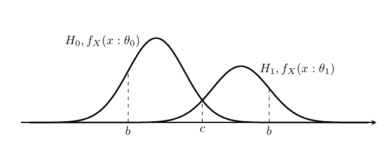

## 仮説検定
**仮説検定**(hypothesis testing)とは,関心のある仮説が発生事象に
因果関係があるかどうかを判定することである.
ここで,仮説は標本の母集団の母数や確率分布である.
仮説検定の要点は,検証したい仮説と排他な仮説を設定して,
これを検証し,関心のある仮説が成立するかを判断する.
数学で"何かが成立する"を証明する際に,"反例がある"と証明が成立しないのと同じ考えで,
排他な仮説の確率が高いということは,仮説に反例があるという確率が高いと判断して,
対象の仮説が成立しないと考える.

### 無帰仮説と対立仮説

### 仮説
仮説検定の仮説とは,標本の母集団の母数のことである.
通常,統計量を仮説として用いて,それを**検定統計量**(test statistic)という.

#### 帰無仮説
**帰無仮説**(null hypothesis)は無価値な仮説という意味で,
検定したい仮説が成立するために,成立してほしくない仮説で,
帰無仮説が棄却することで,対象の仮説の正しさの確率を高める.
検定したい仮説を対立する仮説が採用される.\\(H_0\\)と表される.

#### 対立仮説
**対立仮説**(alternative hypothesis)は帰無仮説と対立する仮説で,
帰無仮説が棄却したときに成立する仮説である.こちらが,興味のある対象の仮説になる.
\\(H_1\\)と表される.

### 検定の設定
確率変数列&thinsp;\\(\\{X_i\\} _{i \in \mathbb{N} _+,i \leq n}\\)を,
確率密度関数\\(f _X(x:\theta)\\)からの無作為標本とする.
この確率密度関数のパラメータが属するパラメータ空間を\\(\Theta\\)とする.
この空間を\\(\Theta _1 = \Theta \backslash \Theta_0\\)と分割する.
ここで\\(\theta \in \Theta _0\\)となる仮説を帰無仮説として,
\\(H_0 : \theta \in \Theta _0\\)と表し,
\\(\theta \in \Theta _1\\)ととなる仮説を対立仮説とし,\\(H_1 : \theta \in \Theta _1\\)と表す.
\\(\Theta _0, \Theta _1\\)が一つの要素(シングルトン)のときは,**単純仮説**(simple hypothesis)といい,
複数の要素から構成されるときは,**複合仮説**(composite hypothesis)という.

