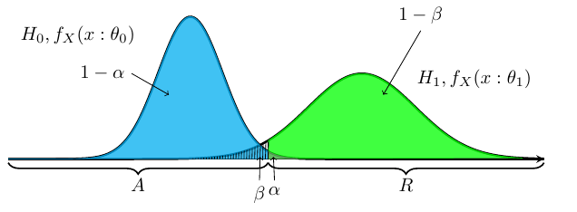

## 統計的仮説検定
**仮説検定**(hypothesis testing)とは,関心のある仮説が発生事象に
因果関係があるかどうかを判定することである.
ここで,仮説は標本の母集団の母数や確率分布である.
仮説検定の要点は,検証したい仮説と排他な仮説を設定して,
これを検証し,関心のある仮説が成立するかを判断する.
数学で"何かが成立する"を証明する際に,"反例がある"と証明が成立しないのと同じ考えで,
排他な仮説の確率が高いということは,仮説に反例があるという確率が高いと判断して,
対象の仮説が成立しないと考える.

### 無帰仮説と対立仮説

### 仮説
仮説検定の仮説とは,標本の母集団の母数のことである.
通常,統計量を仮説として用いて,それを**検定統計量**(test statistic)という.

#### 帰無仮説
**帰無仮説**(null hypothesis)は無価値な仮説という意味で,
検定したい仮説が成立するために,成立してほしくない仮説で,
帰無仮説が棄却することで,対象の仮説の正しさの確率を高める.
検定したい仮説を対立する仮説が採用される.\\(H_0\\)と表される.

#### 対立仮説
**対立仮説**(alternative hypothesis)は帰無仮説と対立する仮説で,
帰無仮説が棄却したときに成立する仮説である.こちらが,興味のある対象の仮説になる.
\\(H_1\\)と表される.

### 検定の設定
確率変数列&thinsp;\\(\\{X_i\\} _{i \in \mathbb{N} _+,i \leq n}\\)を,
確率密度関数\\(f _X(x:\theta)\\)からの無作為標本とする.
この確率密度関数のパラメータが属するパラメータ空間を\\(\Theta\\)とする.
この空間を\\(\Theta _1 = \Theta \backslash \Theta_0\\)と分割する.
ここで\\(\theta \in \Theta _0\\)となる仮説を帰無仮説として,
\\(H_0 : \theta \in \Theta _0\\)と表し,
\\(\theta \in \Theta _1\\)ととなる仮説を対立仮説とし,\\(H_1 : \theta \in \Theta _1\\)と表す.
\\(\Theta _0, \Theta _1\\)が一つの要素(シングルトン)のときは,**単純仮説**(simple hypothesis)といい,
複数の要素から構成されるときは,**複合仮説**(composite hypothesis)という.

帰無仮説のパラメータに従う確率密度関数を&thinsp;\\(f_X(x:\theta_0)\\),
対立仮説のパラメータに従う確率密度関数を&thinsp;\\(f_X(x:\theta_1)\\)とする.
ここで,標本\\(X_i\\)から\\(\theta\\)が,\\(\Theta _0, \Theta _1\\)どちらに属するかを判定する問題が仮説検定である.

上図で,標本\\(X_i\\)が\\(a\\)の位置にあるなら&thinsp;\\(H_0\\)を支持し,\\(b\\)の位置にあるなら&thinsp;\\(H_1\\)を支持し,
\\(c\\)の位置にあるなら判定を保留したいと考えたい.しかし,仮説検定では判断を保留すると言う態度を取らない.
標本空間\\(\Omega\\)の中に集合\\(R,A=\Omega \backslash R\\)を設定し,\\(X_i \in R\\)である時&thinsp;対立仮説が成立すると設定する.

#### 仮説検定方式
**仮説検定方式**(hypothesis testing procedure)とは,標本空間\\(\Omega\\)を帰無仮説\\(H_0\\)を**棄却**(reject)する空間と,**受容**(accept)する空間に分割し,設定を行うことである.
\\[
	R = \\{x \in \Omega | H_0を棄却する \\} \\\\
	A = \Omega \backslash R = \\{x \in \Omega | H_0を受容する \\}
\\]
\\(R\\)を\\(H _0\\)の**棄却域**(rejection region),\\(A\\)を\\(H _0\\)の**受容域**(acceptance region)と言う.
\\(R,A\\)を決定する,標本\\(\\{X_i\\} _{i \in \mathbb{N} _+,i \leq n}\\)に基づいた統計量\\(T=T(\mathbf{X})\\)を検定統計量と言う.

#### 検定関数
\\[
	\phi (\mathbf{X}) = I _R(\mathbf{X}) = \left \\{
		\begin{array}{ll}
		1 & \mathbf{X} \in R \\\\
		0 & \mathbf{X} \not \in R
		\end{array}
	\right.
\\]
と棄却域に関しての指示関数を**検定関数**(testing function)と言う.

### 設定された検出の評価

上の図にて,\\(H_0:\theta_0\\)の帰無仮説が正しいにもかかわらず,
\\(H_1:\theta_1\\)の対立仮説が正しいと判断するという誤りを**第一種の誤り**(タイプ1エラー:type \\({\rm I}\\) error)という.第一種の誤りを犯す確率は,上図の\\(\alpha\\\)が指す面積になる.
\\[
	\alpha = P_{H_0}(X \in R:\theta_0) = \int _{R} f_X(x:\theta_0) dx
\\]
帰無仮説\\(H_0\\)が正しいときに帰無仮説\\(H_0\\)を棄却しない確率は,
\\[
	1 - \alpha = P _{H _0}(X \not \in R:\theta_0)
\\]
と表され,\\(\theta _0\\)に対する**信頼率**(confidence level)という.

反対に,対立仮説\\(H_1\\)が正しいにもかかわらず,帰無仮説\\(H_0\\)が正しいと判断する誤りを**第二種の誤り**(タイプ2エラー:type  \\({\rm II}\\) error)という.
第二種の誤りを犯す確率は,上図の\\(\beta\\\)が指す面積になる.
\\[
	\beta = P _{H _1}(X \not \in R:\theta_1) = \int _{R^c} f_X(x:\theta_1) dx
\\]
対立仮説\\(H_1\\)が正しいときに帰無仮説\\(H_0\\)を棄却する確率は,
\\[
	1-\beta = P _{H _1}(X \in R:\theta_1)
\\]
と表され,\\(\theta _1\\)に対する**検出力**(power)という.
検出力を\\(\theta\\)の関数みなした時,
\\[
	\beta(\theta) = 1-\beta = 1 - \int _{R^c} f_X(x:\theta) dx = \int _{R} f_X(x:\theta) dx
\\]
を**検出力関数**(power function)という.

設定された仮説は,第一種の誤り,第二種の誤りがともに小さいほうが良い.
まず,帰無仮説を棄却する時は,間違っていても低い確率で間違いたい.
つまり,第一種の誤りが小さいほうが良い.第一種の誤りが小さいということは,
信頼率が高いということになる.
そこで,まず第一種の誤り\\(\alpha\\)に対して,以下を満たすように,棄却域\\(R\\)を設定する.
\\[
	\sup_{\theta \in \Theta_0} P(X \in R:\theta) \leq \alpha
\\]

この\\(\alpha\\)を**有意水準**(significance level)といい,
通常\\(\alpha=0.05,\alpha=0.01\\)となるように,\\(R\\)を設定する.

次に,第二種の誤り\\(\beta\\)を有意水準の範囲で小さくしたい.
有意水準\\(\alpha\\)の検定で,第二種の誤りが最も小さいものを,
有意水準\\(\alpha\\)の**最強力検定**(most powerful test)という.
